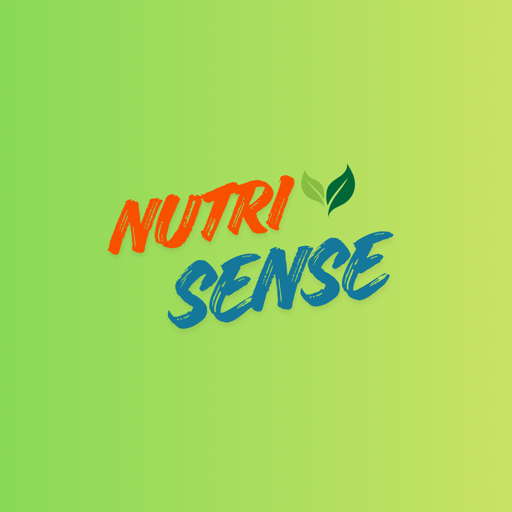

# 🥗 NutriSense — AI Food Nutrition Scanner

<p align="center">
  
</p>

<p align="center">
  <strong>AI-powered food nutrition scanner mobile app built with React Native + Expo</strong>
</p>

<p align="center">
  
  
  
  
</p>

---

## 📱 Features

| Feature | Description |
|---|---|
| 📸 AI Food Scanner | Scan food using camera or gallery — Groq Vision AI identifies it instantly |
| 🤖 AI Nutritionist Chat | Chat with LLaMA 3 AI for diet advice and nutrition tips |
| 📊 Nutrition Tracking | Real-time calories, protein, carbs, fat, fiber tracking |
| 📈 History & Charts | 7-day calorie trends and macro breakdown charts |
| 👤 Profile & BMI | BMI, BMR calculator with personalized calorie goals |
| 🗺️ Nearby Restaurants | Find healthy restaurants near you using OpenStreetMap |
| 🔔 Push Notifications | Daily meal reminders and meal logged notifications |
| ☁️ Cloud Sync | Scan history synced to cloud via Supabase |
| 🌙 Dark Theme | Beautiful dark UI optimized for mobile |

---

## 🛠️ Tech Stack

### Mobile (Frontend)
- **React Native** + **Expo SDK 53**
- **Supabase** — Authentication + Database
- **Groq API** — Vision AI (food recognition) + LLaMA 3 Chat
- **Edamam API** — Nutrition data
- **OpenStreetMap** — Nearby restaurants
- **React Navigation** — Tab navigation
- **AsyncStorage** — Local data persistence
- **Expo Notifications** — Push notifications

### Backend
- **FastAPI** (Python) — REST API
- **Railway** — Cloud deployment
- **JWT** — Authentication middleware
- **Supabase** — Database operations

---

## 🚀 Getting Started

### Prerequisites
- Node.js 18+
- Expo CLI
- Python 3.12+ (for backend)

### Mobile Setup

```bash
# Clone the repo
git clone https://github.com/poojasri05-hub/nutrisense-mobile.git
cd nutrisense-mobile

# Install dependencies
npm install

# Create .env file
cp .env.example .env
# Fill in your API keys in .env

# Start the app
npx expo start
```

### Environment Variables

Create a `.env` file with:
```env
EXPO_PUBLIC_SUPABASE_URL=your-supabase-url
EXPO_PUBLIC_SUPABASE_ANON_KEY=your-supabase-anon-key
EXPO_PUBLIC_GROQ_API_KEY=your-groq-api-key
EXPO_PUBLIC_EDAMAM_APP_ID=your-edamam-app-id
EXPO_PUBLIC_EDAMAM_APP_KEY=your-edamam-app-key
```

---

## 📁 Project Structure
